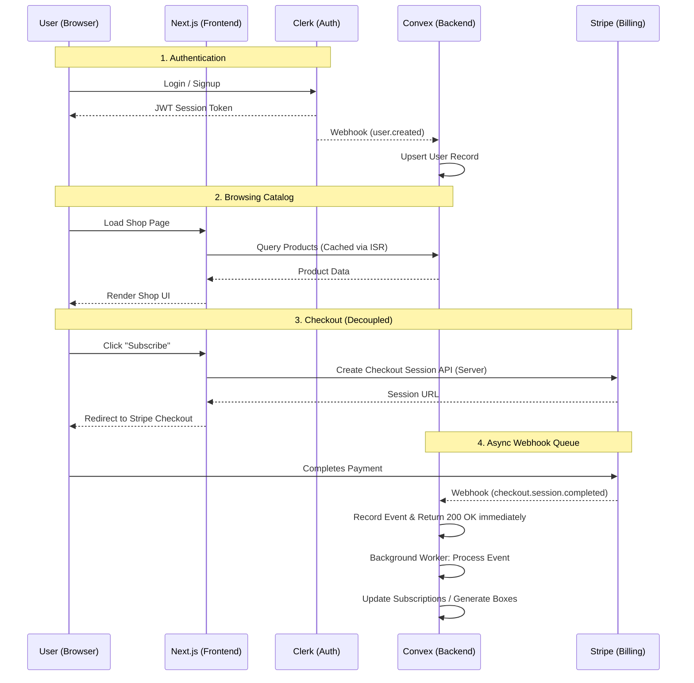

# Lume Refillery - System Architecture

This document maps out the core data flow and architectural dependencies of the Lume Refillery platform. 
Our primary focus is ensuring decoupling and resilience, meaning no single external provider going down will take down the entire system.

## High-Level Architecture

The system is broken down into four main pillars:
1. **Next.js (Client & SSR):** Handles the UI, edge-caching for the product catalog, and checkout session generation.
2. **Clerk (Identity):** Manages user authentication and JWT session tokens.
3. **Convex (Database & Logic):** The source of truth for inventory, user profiles, and subscription data.
4. **Stripe (Billing):** Handles PCI-compliant checkout and recurring billing.

### Data Flow Diagram

## Resilience & Fallbacks

- **Stripe Downtime:** Because webhooks are ingested directly into an async Convex queue (`webhookEvents`), if our background processing fails (or if Stripe takes too long), we never time-out the Stripe webhook. Failed events stay in the queue to be manually or automatically retried.
- **Frontend Degradation:** The UI uses `<ErrorBoundary>` components around checkout features. If Stripe's API is unreachable from the client, the UI falls back to a graceful error state rather than crashing the shop.
- **Product Catalog Caching:** The product catalog is fetched via Convex but can be cached at the Next.js edge level using ISR (Incremental Static Regeneration). This prevents our database from being hammered by read requests during a traffic spike.
